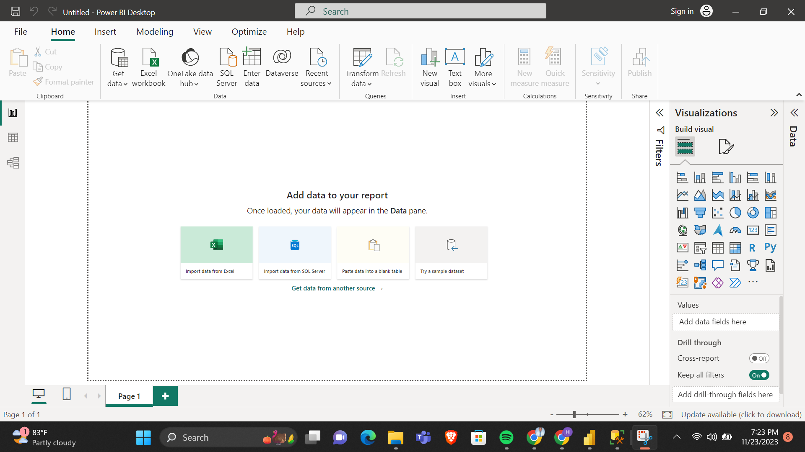
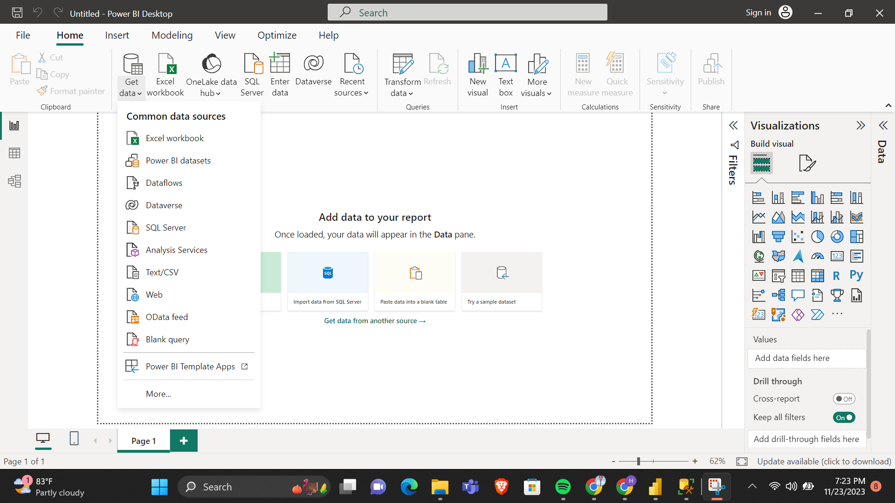
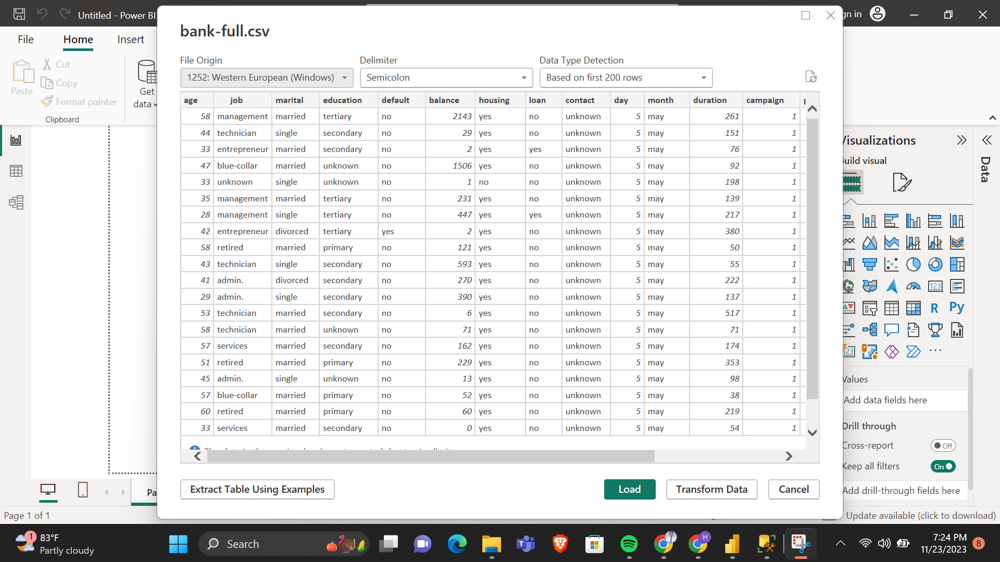
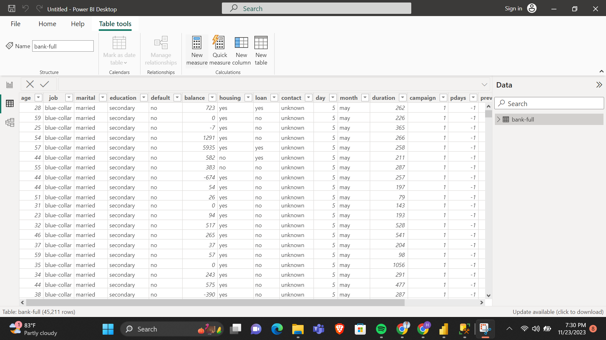
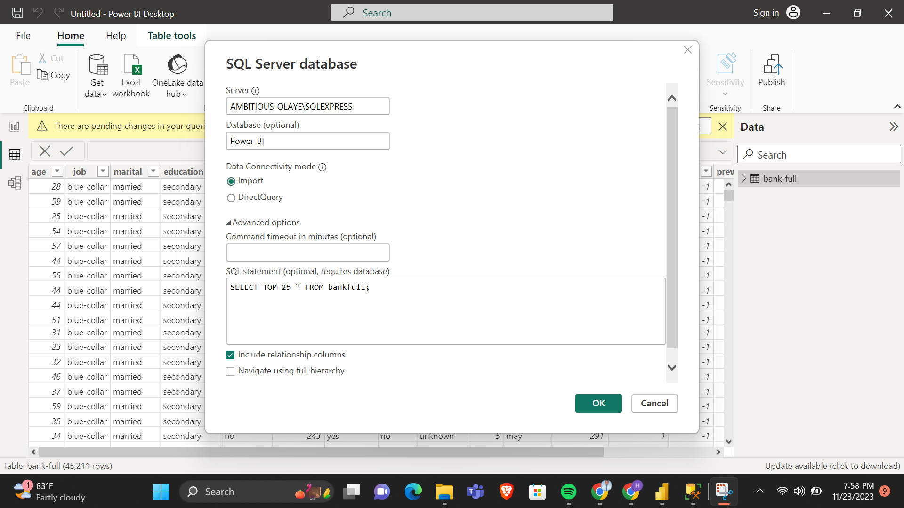
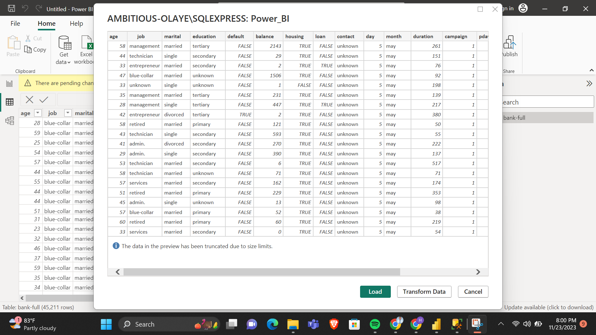
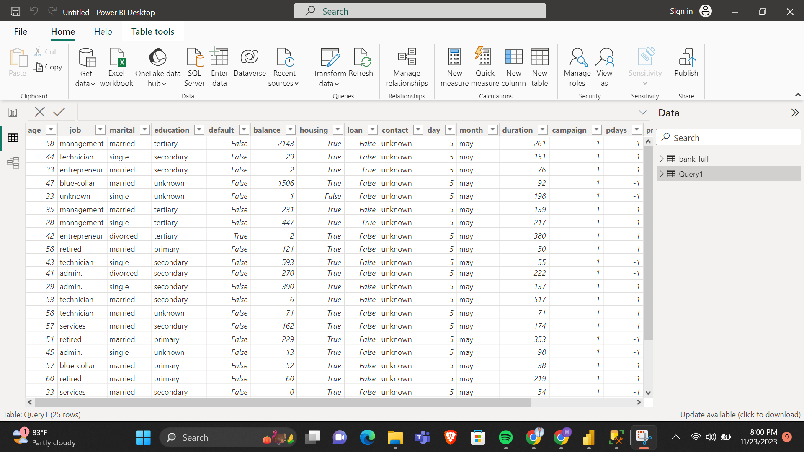

# Introduction:

This is a task to import data from various sources into Power BI. For this task, I am importing data into Power BI using the csv file option and from SQL server. 

## Problem Statement: 

•	Import the ‘Bank Term Deposit Subscription’ dataset into your Power BI Desktop using the csv file option
•	Load the dataset into a database in SQL Server, connect your Power BI desktop to this database and import only the first 25 rows into your desktop for analysis. 

## Skills demonstrated

•	Importing data

## Data Source: 

The data was provided by my tutor to work with. 

**Task 1: Import the ‘Bank Term Deposit Subscription’ dataset into your Power BI Desktop using the csv file option.**

Step 1: Click on ‘Get Data’ and it will give a dropdown of various data sources. 



Step 2: Click on the required data source which is ‘Text/CSV’.



Step 3: Select the data from your file and preview, then click on ‘load’ to upload the data.



Step 4: The data have been imported and will be available for viewing and analysis. To view, click on ‘table view’. 



**Task 2: Load the dataset into a database in SQL Server, connect your Power BI desktop to this database and import only the first 25 rows into your desktop for analysis.**

Step 1: Click on ‘SQL Server from the Home page and this will return a page to input the necessary credentials. 


Step 2: Input your SQL server’s name, database name and the query since we are returning a part of the dataset, not the whole. The query is below: 

```
SELECT TOP 25 * FROM bankfull;
```


Step 3: After inputting the details, click ‘ok’ and it will return the preview of the data. After previewing the data, click on ‘load’ to finally import the dataset. 



Step 4: The dataset is ready for analysis and can be viewed by clicking on ‘table view’. 


